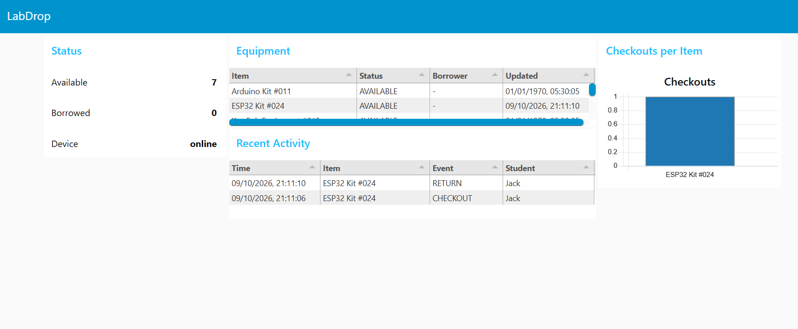

# LabDrop: Smart Lab Equipment Checkout System

RFID-based lab equipment tracking using an ESP32 and MQTT. A student scans their
ID card, then an equipment tag. The system updates the item's state, gives
feedback on an OLED, LEDs and a buzzer, and publishes the event to a live
dashboard and a CSV log.

Built as an IoT mini project. Simulated in Wokwi.

## How it works

```
RFID tag -> RC522 -> ESP32 -> OLED / LEDs / buzzer
                        |
                      Wi-Fi -> MQTT broker -> Web dashboard + Python CSV logger
```

## Hardware (simulated)

ESP32 DevKit, MFRC522 RFID reader, SSD1306 OLED, green and red LEDs, buzzer

## Run it

1. Open the Wokwi project: `<add-your-wokwi-link>` (or create a new ESP32 project and copy the files from `firmware/`).
2. In `firmware/sketch.ino`, set `ROOT` to a unique topic name and add your card UIDs (scan a card in Wokwi, read the UID from the Serial Monitor).
3. In `dashboard/dashboard.html`, set `TOPIC_ROOT` to the same name, then open the file in a browser.
4. (Optional) `pip install -r logger/requirements.txt`, set `ROOT` in `logger/logger.py`, then run `python logger/logger.py`.

## MQTT topics

| Topic | Purpose |
|---|---|
| `ROOT/equipment/<id>` | Item state (retained) |
| `ROOT/events` | Checkout/return log |
| `ROOT/alerts` | Unknown tag scans |
| `ROOT/status` | Device online/offline (Last Will) |

## Screenshots

Add images to `docs/screenshots/` and link them here:

```

```

## Tech

C++ (Arduino), JavaScript, Python, MQTT (HiveMQ public broker), Wokwi

## Limitations / future work

Public broker without authentication, no database, simulated hardware only.

## Credits

Libraries: MFRC522, Adafruit SSD1306/GFX, PubSubClient, MQTT.js, paho-mqtt.
